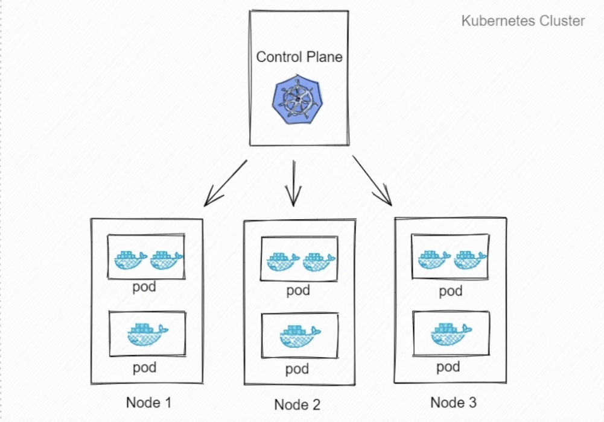

### Kubernetes

#### 容器部署优势

- 敏捷应用程序的创建和部署：与使用 VM 镜像相比，提高了容器镜像创建的简便性和效率。
- 持续开发、集成、部署
- 资源利用，资源隔离
- 更适用于分布式环境，应用程序被分解成较小的独立部分，可以部署在不同的物理机上，由于容器的统一性，规避了在不同机器上有可能出现不同问题的可能性
- 开发与运维的分离：开发者更多work在镜像生成的时间节点之前。

#### kubernetes是什么？

- 是一个可扩展，可移植的开源平台，用于管理容器化的工作负载和服务，可促进声明式配置和自
  动化，拥有一个庞大且快速增长的生态。

  

#### 为什么需要kubernetes?

- 在生产环境中，容器运行会出现不同程度的故障，如果全部都由开发者来管理这些运行着的容器，并确保服务的可用性，则人力成本会显著增大，而且对于故障的响应往往不如自动化的程序及时。
- kubernetes提供了一个可弹性运行分布式系统的框架
  - 服务发现和负载均衡: Kubernetes 可以使用 DNS 名称或自己的 IP 地址来暴露容器。 如果进入容器的流量很大， Kubernetes 可以负载均衡并分配网络流量，从而使部署稳定.
  - 存储编排：Kubernetes 允许你自动挂载你选择的存储系统，例如本地存储、公共云提供商等。
  - 自动部署和回滚：你可以使用 Kubernetes 描述已部署容器的所需状态， 它可以以受控的速率将实际状态更改为期望状态。 例如，你可以自动化 Kubernetes 来为你的部署创建新容器， 删除现有容器并将它们的所有资源用于新容器。
  - 自我修复：Kubernetes 将重新启动失败的容器、替换容器、杀死不响应用户定义的运行状况检查的容器， 并且在准备好服务之前不将其通告给客户端。

#### Pod

- k8s调度管理的最小单位，一个pod可以包含一个或者多个容器，每个Pod有自己的虚拟ip,一个工作节点可以有多个pod，主节点会考量负载自动调度pod到哪个节点运行。

  

#### kubernetes调度器

- 调度：是指将

  [^Pod]: 是指集群上正在运行的一组容器

  放置到合适的节点上，以便对应节点上的

  [^kuelet]: 一个在集群中每个节点上运行的代理，它保证容器都运行在Pod中

  能够运行这些pod.

- 调度概览：调度器通过 Kubernetes 的监测（Watch）机制来发现集群中新创建且尚未被调度到节点上的 Pod。 调度器会将所发现的每一个未调度的 Pod 调度到一个合适的节点上来运行。 调度器会依据下文的调度原则来做出调度选择。

- kube-scheduler

  - kubernetes集群的默认调度器，属于集群

    [^控制平面]: 指容器编排层，它暴露API和接口来定义，部署容器和管理容器的生命周期

    ，用户可以自己实现属于自己的kuber-scheduler去替换。

  - 调度策略

    1. 过滤：过滤阶段会将所有满足Pod调度需求的节点选出来
    2. 打分：根据打分规则给每一个可调度节点打分

     最后kube-scheduler会将pod调度到得分最高的节点上

     **过滤和打分规则可配置**

  

  

​			

